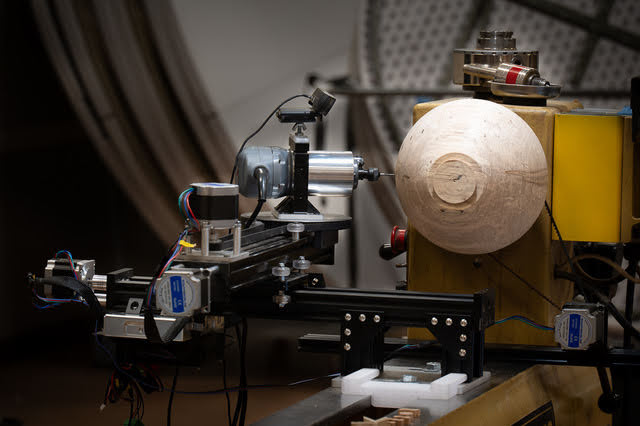

Updated Jan. 12, 2025.
Find out more about the LatheEngraver at https://www.transpirationturning.com

# The LatheEngraver

* The LatheEngraver is a bolt-on CNC for the woodlathe. It is primarily an embellishing tool that can replace many jigs. You can use any number of tools including routers and lasers to create unique and intricate designs.
* Technically it is a 4-axis CNC with two rotary axes. This is important because by being able to rotate the tool via the B-axis,the tool to be normal to work piece. This means it is capable of following the profile of a piece to keep the depth-of-cut consistent.
* One goal of the project was to make it as easy to use as possible. For simple operations any 3-axis CAM software can be used to generate gcode. The LatheEngraver utilizes OctoPrint as its gcode sender with a number of specialized plugins. These plugins can use the 3-axis CAM as a template that will be modified to allow on-the-fly coordinate modifications.

# This repository
* All the 3D printed parts and machined aluminum parts necessary to build a LatheEngraver are housed here.
* Firmware (GrblHal) for several control boards is available.